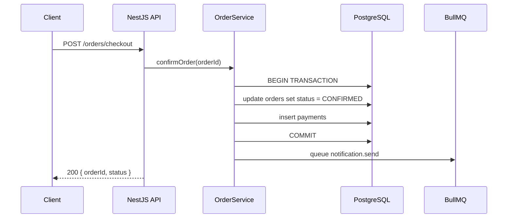
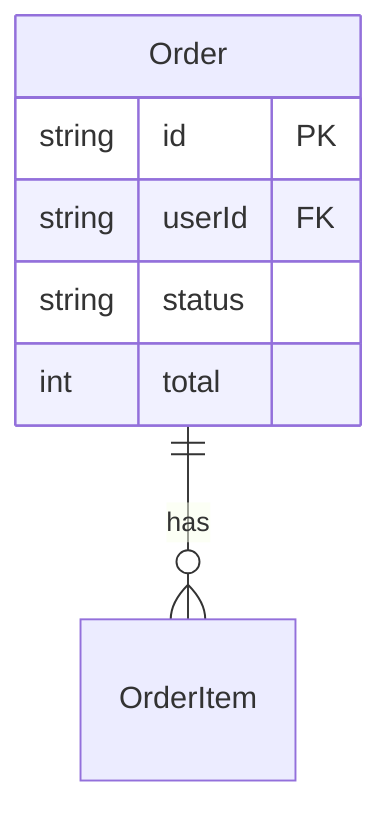

# Document Templates

Use these templates when generating docs. Fill every section.
Write `Unknown — ask team` rather than leaving any field blank.

---

## Template 1: KNOWLEDGE.md

```markdown
---
repomind_version: 3.0
generated: {{DATE}}
git_sha: {{GIT_SHA}}
---

# RepoMind: {{REPO_NAME}}

> {{ONE_LINE_PURPOSE}}

## Identity
| Field | Value |
|---|---|
| Repo | {{REPO_NAME}} |
| Owner Team | {{TEAM_NAME or "Unknown — ask team"}} |
| Type | Backend API / Fullstack / SPA / Monorepo |
| Environment | production / staging / internal |

## Tech Stack
| Layer | Technology |
|---|---|
| Runtime | Node.js {{version}} · TypeScript {{version}} |
| Backend Framework | NestJS {{version}} / Express / Fastify |
| Frontend Framework | Next.js {{version}} / React {{version}} / None |
| Database | PostgreSQL / MySQL / MongoDB {{version}} |
| ORM | Prisma {{version}} / TypeORM {{version}} |
| Cache | Redis {{version}} |
| Queue | BullMQ / Kafka / RabbitMQ / None |
| Auth | JWT / OAuth2 / Session |
| Testing | Jest / Vitest · Supertest · Playwright |
| Deployment | Docker / Kubernetes / Vercel / Cloud Run |

## Domain Glossary
| Term | Meaning |
|---|---|
| {{term}} | {{definition as used in this codebase}} |

## Architecture Overview
```
{{Describe how layers connect — example:}}

  Next.js (SSR / App Router)
       ↓ API calls
  NestJS REST API
       ↓              ↓
  Service Layer    Queue Processors (BullMQ)
       ↓               ↓
  Repository     Redis (cache + jobs)
       ↓
  PostgreSQL (Prisma)
       ↓
  External: Stripe · SendGrid · S3
```

## Flows Index
| # | Flow | Doc | Status |
|---|---|---|---|
| 1 | {{Flow Name}} | docs/expert/{{slug}}.md | ✅ ready |
| 2 | {{Flow Name}} | docs/expert/{{slug}}.md | 🔵 lazy |

## Frontend Areas Index
| # | Area | Doc | Status |
|---|---|---|---|
| 1 | {{Area Name}} | docs/expert/{{slug}}.md | ✅ ready |

## Key Integrations
| Integration | Type | Direction | Notes |
|---|---|---|---|
| {{e.g. Stripe}} | External API | Outbound | Payment processing |
| {{e.g. SendGrid}} | External API | Outbound | Transactional email |

## Known Tech Debt
| Area | Issue | Risk | Priority |
|---|---|---|---|
| {{module}} | {{description}} | 🔴/🟡/🟢 | Sprint N / Backlog |

## Notes from the Team
{{Free text — business rules, legacy quirks, naming conventions, pain points}}

---
_Last refreshed: {{DATE}} · git sha: {{GIT_SHA}}_
```

---

## Template 2: Flow Doc (docs/expert/{{flow-name}}.md)

```markdown
---
generated: {{DATE}}
git_sha: {{GIT_SHA}}
source_files:
  - {{path/to/relevant/file.ts}}
---

# {{Flow Name}}

> {{One paragraph: what this flow does, who triggers it, why it exists}}

## Entry Point
- **Trigger**: {{HTTP endpoint / Queue job / Scheduled task / Event}}
- **Caller**: {{Client app / Internal service / External system}}
- **Auth required**: {{Yes — JWT Bearer / No / API Key}}

## Happy Path Sequence



## Step-by-Step Breakdown

### Step 1: {{Step Name}}
- **Where**: `{{ServiceName}}.{{methodName}}()` in `{{file path}}`
- **What**: {{what this step does}}
- **Inputs**: {{what it receives}}
- **Outputs**: {{what it produces}}
- **Side effects**: {{DB writes, cache updates, events published, jobs queued}}

## Data Model


## Error Scenarios
| Scenario | Where caught | Behavior |
|---|---|---|
| {{e.g. Payment declined}} | `PaymentService` | Returns 402, order stays PENDING |
| {{e.g. DB timeout}} | Repository | 500, global error filter |

## Business Rules
- {{Rule 1}}
- {{Rule 2}}

## Test Scenarios

### Happy Path
- [ ] Given valid input, when X is called, then Y happens

### Edge Cases
- [ ] {{scenario}}

### Failure Paths
- [ ] {{scenario}}

### Idempotency
- [ ] {{duplicate request scenario}}

### Race Conditions
- [ ] {{concurrent request scenario}}

## Performance Notes
- **Expected volume**: {{N requests/minute at peak}}
- **P99 latency target**: {{Xms}}
- **Known bottlenecks**: {{e.g. payment gateway adds 2-3s latency}}
- **Caching**: {{what is cached, where, TTL}}

## Tech Debt in This Flow
| Issue | Impact | Ticket |
|---|---|---|
| {{issue}} | {{impact}} | #{{n}} |

---
_Generated by RepoMind · {{DATE}} · git sha: {{GIT_SHA}}_
```

---

## Template 3: post-merge git hook

```bash
#!/bin/bash
# RepoMind — auto staleness check on merge

echo ""
echo "RepoMind: Checking for stale docs after merge..."
npx tsx "$(git rev-parse --show-toplevel)/.claude/skills/megaopt-repo-expert/scripts/refresh.ts" --check-only
echo ""
```

---

## Template 4: GitHub Actions workflow

```yaml
# .github/workflows/repomind-refresh.yml
name: RepoMind — Refresh Knowledge Docs

on:
  pull_request:
    types: [closed]
    branches: [main, master]

jobs:
  refresh-docs:
    name: Refresh RepoMind Knowledge
    if: github.event.pull_request.merged == true
    runs-on: ubuntu-latest
    permissions:
      contents: write

    steps:
      - uses: actions/checkout@v4
        with:
          fetch-depth: 0

      - uses: actions/setup-node@v4
        with:
          node-version: '20'
          cache: 'npm'

      - run: npm ci

      - name: Run RepoMind refresh
        env:
          ANTHROPIC_API_KEY: ${{ secrets.ANTHROPIC_API_KEY }}
          BASE_SHA: ${{ github.event.pull_request.base.sha }}
          HEAD_SHA: ${{ github.event.pull_request.merge_commit_sha }}
        run: |
          npx tsx .claude/skills/thrift-repo-expert/scripts/refresh.ts \
            --base-sha "$BASE_SHA" \
            --head-sha "$HEAD_SHA" \
            --auto

      - name: Commit updated docs
        run: |
          git config user.name "RepoMind"
          git config user.email "repomind@noreply"
          git add docs/expert/ KNOWLEDGE.md
          git diff --staged --quiet || \
            git commit -m "docs: RepoMind refresh after PR #${{ github.event.pull_request.number }}"
          git push
```
